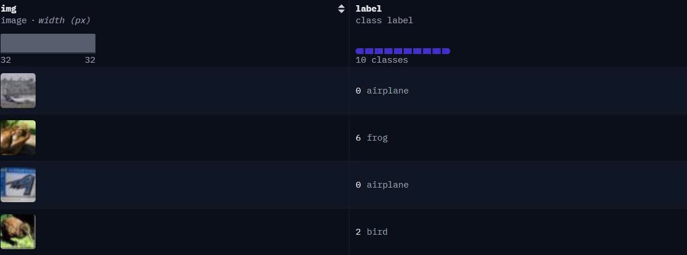
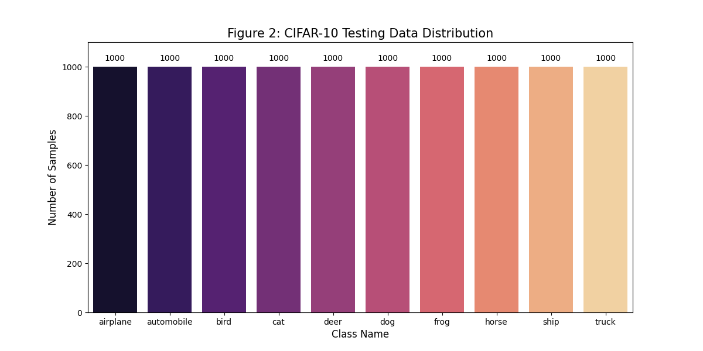
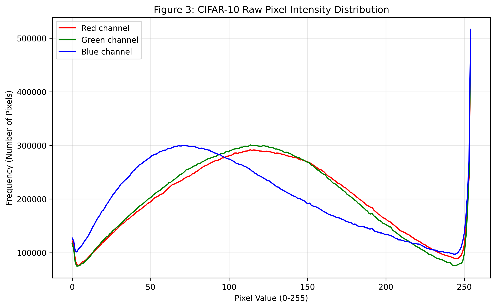
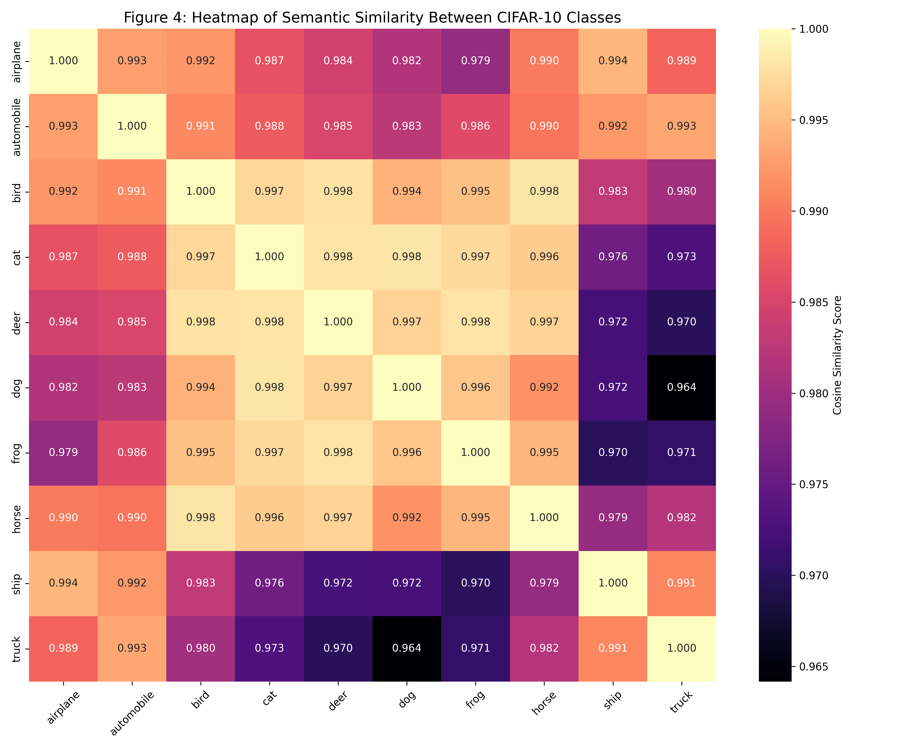

# Image Dataset Classification

**Group:** LTH (252)  
**Course:** Deep Learning (CO3021)  
**Institution:** Ho Chi Minh City University of Technology (HCMUT)

---

## 1. Dataset Exploration & Preprocessing

### 📊 Dataset Overview: CIFAR10

The project utilizes the **CIFAR10 (Canadian Institute For Advanced Research - 10)** dataset, a standard benchmark for image classification tasks. The primary objective is to evaluate and compare the performance of CNN and Vision Transformer (ViT) architectures.

- **Data Source:** [Hugging Face - CIFAR10 Dataset](https://huggingface.co/datasets/uoft-cs/cifar10)
- **Problem Type:** Image classification

#### Key Statistics:

| Metric                      | Value                              |
| :-------------------------- | :--------------------------------- |
| **Total Samples**           | 60,000 (50,000 train + 10,000 test)|
| **Unique Classes (Genres)** | 10                                 |
| **Modalities**              | Visual Information (Image)         |

#### Data Characteristics:

- **Visual Data:** The `img` attribute consists of color images with a native resolution of $32 \times 32$ pixels, representing 10 distinct object categories.
- **Label Distribution:** The dataset is perfectly balanced, with each of the 10 classes containing exactly 6,000 samples (5,000 for training and 1,000 for testing).
- **Color Profile:** Pixel intensity analysis shows a non-uniform distribution across channels, specifically a high frequency in the Blue channel (~70 intensity), likely due to sky or water backgrounds.

---

### 🖼️ Dataset Preview

The CIFAR-10 dataset structure maps low-resolution visual imagery to 10 mutually exclusive semantic categories:

  
_Figure 1: Preview of the CIFAR10 dataset structure displaying the mapping between raw 32 × 32 pixel imagery and their corresponding semantic class labels._

---

## 2. In-depth Exploratory Data Analysis (EDA)

To understand the complexity of the CIFAR10 dataset, we conducted a comprehensive analysis focusing on class balance, pixel intensity distributions, and semantic similarities between object categories.

### 📊 Class Distribution & Balance

Analysis of the 10 unique categories reveals a **perfectly balanced distribution**. Unlike many real-world datasets, each class contains exactly 5,000 training and 1,000 testing samples, eliminating the need for oversampling or class-weighted loss functionse.

  
_Figure 2: Balanced distribution of training samples across 10 object categories._
  
_Figure 3: Balanced distribution of testing samples across 10 object categories._

### 🏷️ Statistical Color Profiling (Pixel Distribution)

Our analysis of raw pixel intensities across RGB channels reveals a dominant Blue channel (~70 intensity), suggesting a high frequency of cool-toned backgrounds (sky, water). A sharp spike at 255 across all channels indicates saturated regions or bright highlights.

  
_Figure 4: RGB Pixel Intensity Distribution highlighting the non-uniformity across color channels._

### 🔗 Semantic Class Similarity (Co-occurrence of Features)

The correlation matrix (or Similarity Heatmap) visualizes how certain classes share visual features due to low-resolution (32 × 32). Significant overlap is observed in the Animal cluster (e.g., Cat often shares features with Dog) and the Vehicle cluster (Automobile vs. Truck). Understanding these ambiguities is crucial for interpreting model misclassifications.

  
_Figure 5: Heatmap illustrating the semantic similarity and potential confusion patterns between classes._

---

[⬅️ Back to README](./README.md)
